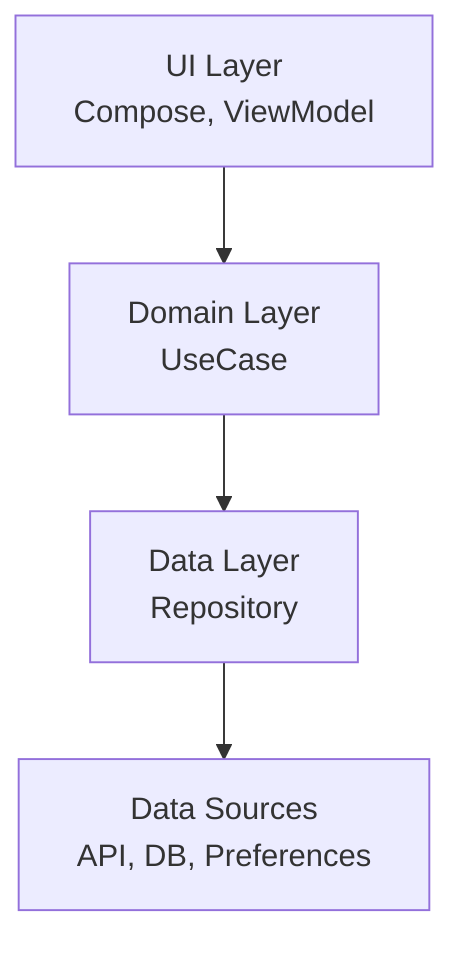
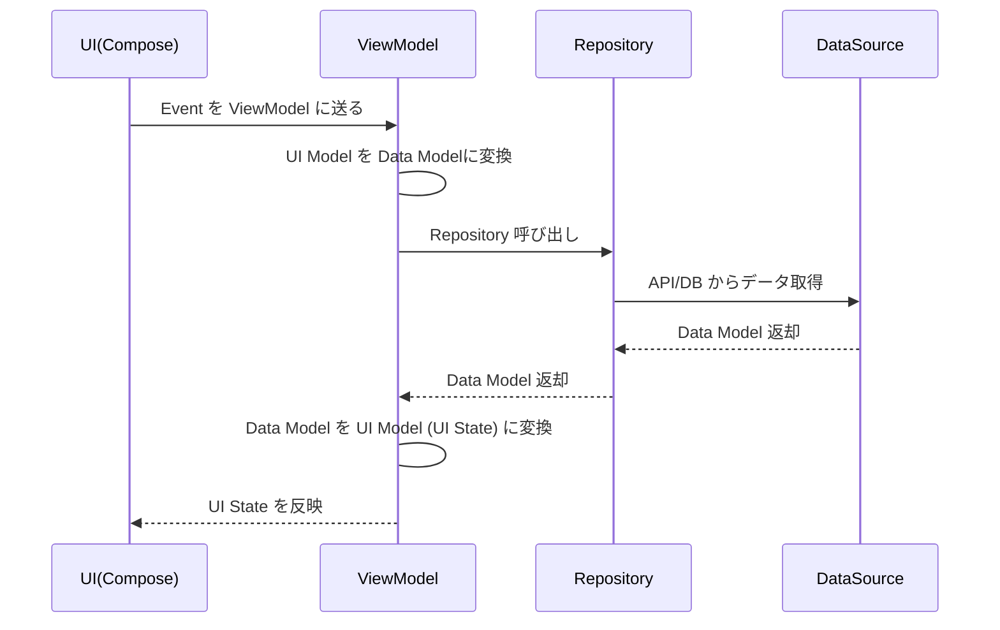
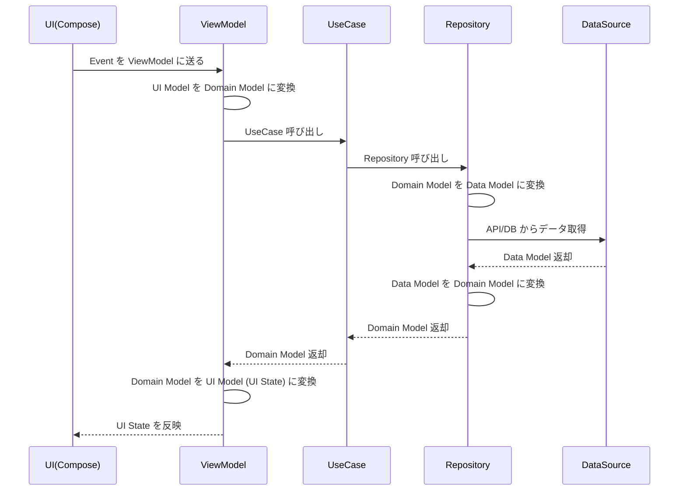

- [アーキテクチャ設計書](#アーキテクチャ設計書)
  - [1. 目的](#1-目的)
  - [2. 全体構成](#2-全体構成)
    - [2.1 全体図（Mermaidで作成）](#21-全体図mermaidで作成)
  - [3. レイヤーの責務](#3-レイヤーの責務)
    - [3.1 UI Layer](#31-ui-layer)
      - [3.1.1 状態とイベントの区別](#311-状態とイベントの区別)
    - [3.2 Domain Layer](#32-domain-layer)
    - [3.3 Data Layer](#33-data-layer)
  - [4. 依存関係ルール](#4-依存関係ルール)
  - [5. データフロー](#5-データフロー)
  - [6. 命名規則](#6-命名規則)
    - [6.1 UI 状態 / イベント](#61-ui-状態--イベント)
    - [6.2 ユースケース](#62-ユースケース)
    - [6.3 リポジトリ / データソース](#63-リポジトリ--データソース)
    - [6.4 モデル](#64-モデル)
  - [7. エラーハンドリング方針](#7-エラーハンドリング方針)
  - [8. 画面遷移ポリシー](#8-画面遷移ポリシー)
  - [9. テスト方針](#9-テスト方針)
  - [10. 今後の拡張](#10-今後の拡張)


# アーキテクチャ設計書

## 1. 目的

この文書は、本アプリケーションのアーキテクチャ方針を明確化し、開発者が共通の理解のもとで保守・拡張できることを目的とする。


## 2. 全体構成

本アプリは Clean Architecture 原則に基づき、以下のレイヤーで構成する。

- UI Layer（Jetpack Compose + ViewModel）
- Domain Layer（UseCase + Domain Models）
- Data Layer（Repository + DataSource + Data Models）

### 2.1 全体図（Mermaidで作成）



## 3. レイヤーの責務

### 3.1 UI Layer

- 画面表示・ユーザー入力の対応 
- ViewModel が保持する UI State の購読と表示 
- ビジネスロジックは保持しない


#### 3.1.1 状態とイベントの区別

- 一回限りのイベントとして管理するもの
  - Snackbar や Toast の表示 / 非表示
  - Navigation Component を使用した画面遷移
- UI 状態として管理する
  - Navigation Component を使用しない画面遷移
    - ダイアログの表示 / 非表示
    - ローディングやインジケーターの表示 / 非表示


### 3.2 Domain Layer

- アプリの意味的ルールを保持 
- UseCase は 1 つのユースケース（操作）を表現 
- ドメインモデルは不変（Immutable）を基本とする


### 3.3 Data Layer

- 永続化・ネットワーク通信などの外部データの取得 
- Domain Layer にのみ依存する 
- Repository は Data モデル or Domain モデルを返す
- DB のテーブルの結合やレコードのソートを行う
  - 取得方法に関することなので Data レイヤーで OK
  - 取得したデータの加工は Domain レイヤーで行うこと


## 4. 依存関係ルール

- 依存方向は UI → Domain → Data の一方向のみ 
- UI は Domain Model や Data Model に依存せず、 UI 状態にのみ依存する
- UI 状態は Domain Model or Data Model に依存しない
- UI 状態は ViewModel が Domain Model or Data Model から生成する


## 5. データフロー

ユーザー操作を起点としたデータの流れを示す。

ドメインレイヤー ( UseCase ) が存在しない場合は以下とする。



UI モデルは画面ごとに異なる。 Repository はそれら全てに対して、データモデルとの変換方法を知っていては、 Repository の責務が多すぎる。よって、画面ごとに存在する ViewModel で変換を実施する。

ドメインレイヤー ( UseCase ) を挟む場合は以下とする。



ドメインモデルからデータモデルへの変換は、 Repository で行う。その理由は、以下の通り。

- 複数のユースケースから、同じ保存処理を呼び出した場合に、それぞれの呼び出し元で、同じ変換処理を繰り返し実装する必要がなくなるため
- Repository は、ビジネスロジックに近い高レベルのモデルを DB 等に保存しやすい低レベルのモデルに変換する役割を担っているため
  - 例えば、 enum で定義された型を Int などのプリミティブな型に変換する。


## 6. 命名規則

### 6.1 UI 状態 / イベント

- State: XxxUiState 
- Event: XxxEvent 
- 動作を表す Boolean は isXxx, shouldXxx


### 6.2 ユースケース

- GetUserInfoUseCase 
- UpdateAccountUseCase


### 6.3 リポジトリ / データソース

- Repository: UserRepository 
- DataSource: UserRemoteDataSource, UserLocalDataSource


### 6.4 モデル

- UI モデル: `XxxUiModel`
- ドメインモデル: `Xxx`
- データモデル:
  - リモートデータの場合 `XxxResponse`
  - リモートデータの複合データの場合 `XxxResponse`
  - ローカルデータの場合 `XxxEntity`
  - ローカルデータの複合データの場合 `XxxLocal`

```
【理由】
ドメインモデルは、 DDD の観点から見ると何もつけない自然な名前にするのが一般的であるため。
ローカルデータは Room の @Entity アノテーションとも親和性があり、認識しやすいため。
```

```
【 UI 状態と UI モデルの違い】
- UI 状態 : ViewModel で直接保持して、 UI に直接渡す入れ物的な存在
- UI モデル : UI 状態に List<T> などで別のモデルが必要な場合に別途定義される UI 専用のモデル
```


## 7. エラーハンドリング方針

- Repository は Result<T> または sealed class を返す 
- 致命的エラーはクラッシュさせる（バグ発見のため） 
- 非致命的エラーは UI State に流し込む


## 8. 画面遷移ポリシー

- Navigation Compose を使用 
- パラメータ渡しは type-safe で行う 
- Modal/BottomSheet は DialogRoute のように独立設計


## 9. テスト方針

- UseCase は単体テスト必須
- Repository は fake 実装で UI テスト可能にする 
- ViewModel は State 更新ロジックに対するテストを行う


## 10. 今後の拡張

- Feature モジュール分割（必要に応じて）
- DataStore を使った設定保存 
- Hilt による依存性注入


