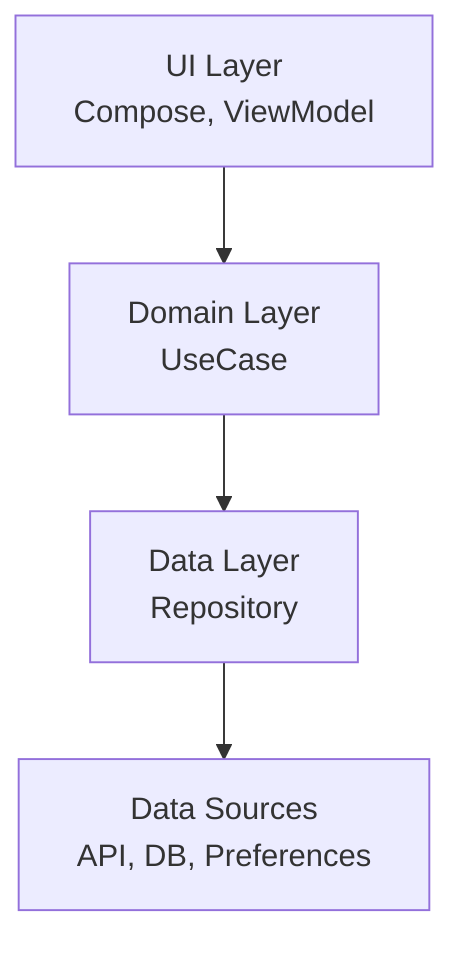
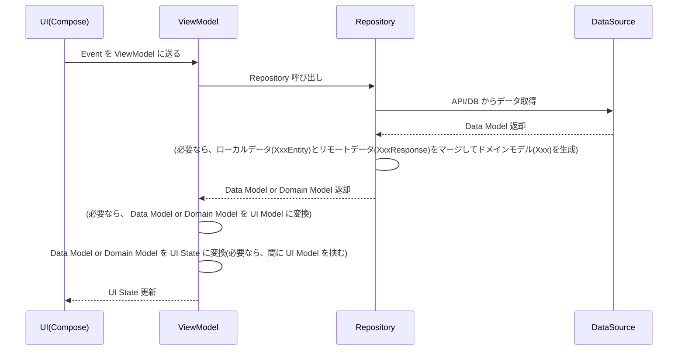
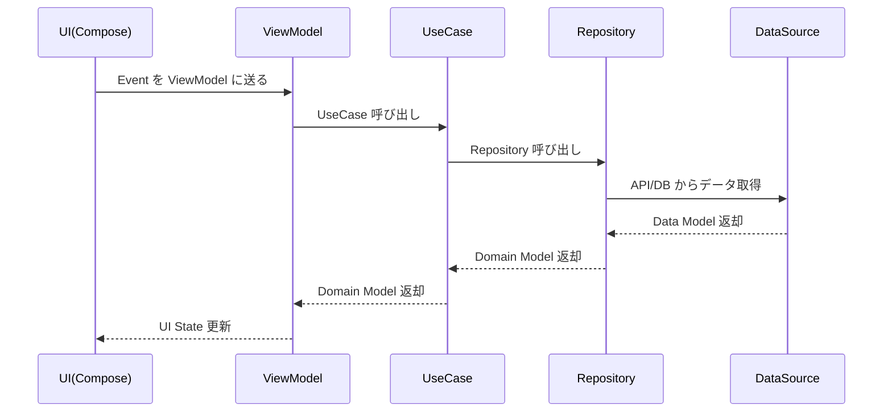

# アーキテクチャ設計書

## 1. 目的

この文書は、本アプリケーションのアーキテクチャ方針を明確化し、
開発者が共通の理解のもとで保守・拡張できることを目的とする。


## 2. 全体構成

本アプリは Clean Architecture 原則に基づき、以下のレイヤーで構成する。

- UI Layer（Jetpack Compose + ViewModel）
- Domain Layer（UseCase + Domain Models）
- Data Layer（Repository + DataSource + Data Models）

### 2.1 全体図（Mermaid）



## 3. レイヤーの責務

### 3.1 UI Layer

- 画面表示・ユーザー入力の対応 
- ViewModel が保持する UI State の購読と表示 
- ビジネスロジックは保持しない


### 3.2 Domain Layer

- アプリの意味的ルールを保持 
- UseCase は 1 つのユースケース（操作）を表現 
- ドメインモデルは不変（Immutable）を基本とする


### 3.3 Data Layer

- 永続化・ネットワーク通信などの外部データの取得 
- Domain Layer にのみ依存する 
- Repository は Domain モデルを返す


## 4. 依存関係ルール

- 依存方向は UI → Domain → Data の一方向のみ 
- UI は Domain Model や Data Model に依存せず、 UI 状態にのみ依存する
- UI 状態は Domain Model or Data Model に依存しない
- UI 状態は ViewModel が Domain Model or Data Model から生成する


## 5. データフロー

ユーザー操作を起点としたデータの流れを示す。



または、 UseCase を挟む場合は以下とします。




## 6. 命名規則

### 6.1 UI State / Event

- State: XxxUiState 
- Event: XxxEvent 
- 動作を表す Boolean は isXxx, shouldXxx


### 6.2 UseCase

- GetUserInfoUseCase 
- UpdateAccountUseCase


### 6.3 Repository / DataSource

- Repository: UserRepository 
- DataSource: UserRemoteDataSource, UserLocalDataSource


### 6.4 モデル名

- UI モデル: `XxxUiModel`
- ドメインモデル: `Xxx`
- データモデル: リモートデータの場合 `XxxResponse` / ローカルデータの場合 `XxxEntity`

```
【理由】
ドメインモデルは、 DDD の観点から見ると何もつけない自然な名前にするのが一般的であるため。
ローカルデータは Room の @Entity アノテーションとも親和性があり、認識しやすいため。
```

## 7. エラーハンドリング方針

- Repository は Result<T> または sealed class を返す 
- 致命的エラーはクラッシュさせる（バグ発見のため） 
- 非致命的エラーは UI State に流し込む


## 8. 画面遷移ポリシー

- Navigation Compose を使用 
- パラメータ渡しは type-safe で行う 
- Modal/BottomSheet は DialogRoute のように独立設計


## 9. テスト方針

- UseCase は単体テスト必須
- Repository は fake 実装で UI テスト可能にする 
- ViewModel は State 更新ロジックに対するテストを行う


## 10. 今後の拡張

- Feature モジュール分割（必要に応じて）
- DataStore を使った設定保存 
- Hilt による依存性注入


