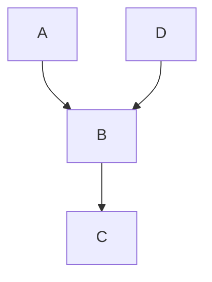

- [シナリオ](#シナリオ)
  - [シナリオ一覧](#シナリオ一覧)
    - [シナリオ１](#シナリオ１)

# シナリオ

ユースケースは、ドメインレベルの操作をまとめたものを定義する。

複数のユースケースをつなげて、ユーザーレベルの操作をまとめたものを、シナリオとして定義する。

必要であれば、別途、画面遷移のフロー図を作成する。

## シナリオ一覧

### シナリオ１

振替元を登録 -> 振替先を登録

